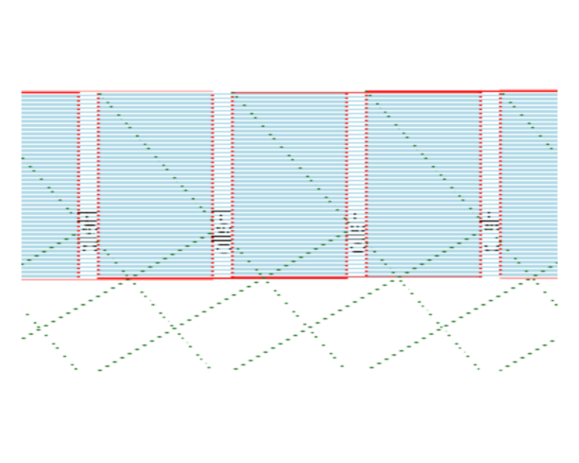

# Rendering pages to bitmaps

[`pdf_render_page()`](https://humanpred.github.io/rpdfium/reference/pdf_render_page.md)
rasterises a PDF page through PDFium’s renderer. The result is a
`pdfium_bitmap` S3 object that inherits from base R’s `nativeRaster`, so
it plugs into
[`graphics::plot()`](https://rdrr.io/r/graphics/plot.default.html),
[`graphics::rasterImage()`](https://rdrr.io/r/graphics/rasterImage.html),
and [`grid::rasterGrob()`](https://rdrr.io/r/grid/grid.raster.html) with
no conversion. Three converters cover the other common shapes downstream
packages expect.

``` r

library(pdfium)
fixture <- system.file("extdata", "fixtures", "shapes.pdf",
  package = "pdfium"
)
```

## A first render

``` r

doc <- pdf_doc_open(fixture)
bmp <- pdf_render_page(doc, dpi = 96)
bmp # a one-line summary
#> <pdfium_bitmap 384x288 @ 96 dpi, page 1 of shapes.pdf>
dim(bmp) # height, width in pixels
#> [1] 288 384

plot(bmp) # uses plot.pdfium_bitmap()
```



The [`plot()`](https://rdrr.io/r/graphics/plot.default.html) call
dispatches to
[`plot.pdfium_bitmap()`](https://humanpred.github.io/rpdfium/reference/plot.pdfium_bitmap.md),
which opens a fresh plot window with `asp = 1` and zero margins and
draws the bitmap with \[graphics::rasterImage()\]. Pass
`interpolate = FALSE` when you want pixel-exact (nearest-neighbour)
display of a small bitmap — useful for embedded raster fixtures.

The bitmap’s dimensions scale linearly with `dpi`. At the default
`dpi = 72`, one pixel per PDF point: a 4 × 3 inch page becomes 288 × 216
pixels. At `dpi = 144`, the same page is 576 × 432.

``` r

dim(pdf_render_page(doc, dpi = 72))
#> [1] 216 288
dim(pdf_render_page(doc, dpi = 144))
#> [1] 432 576
```

## Background and transparency

The default background is white. Pass any colour string
[`grDevices::col2rgb()`](https://rdrr.io/r/grDevices/col2rgb.html)
understands, or `NA` for transparent:

``` r

bmp_red <- pdf_render_page(doc, dpi = 72, background = "red")
bmp_trans <- pdf_render_page(doc, dpi = 72, background = NA)

bmp_red[1L, 1L] # top-left pixel
#> [1] -1
bmp_trans[1L, 1L] # depends on whether page content covers
#> [1] -1
```

## Rotation

Rotation in degrees, applied on top of the page’s own `/Rotate`
attribute. Rotating 90 or 270 swaps the bitmap’s width and height:

``` r

dim(pdf_render_page(doc, dpi = 72, rotation = 0))
#> [1] 216 288
dim(pdf_render_page(doc, dpi = 72, rotation = 90))
#> [1] 288 216
dim(pdf_render_page(doc, dpi = 72, rotation = 180))
#> [1] 216 288
dim(pdf_render_page(doc, dpi = 72, rotation = 270))
#> [1] 288 216
```

## Converting to other shapes

``` r

# A 3D numeric array [H, W, 4] with values in 0..1 - matches the
# format png::writePNG() and pdftools::pdf_render_page() both produce.
arr <- as.array(bmp)
dim(arr)
#> [1] 288 384   4
range(arr)
#> [1] 0 1

# Base R "raster" object - character matrix of "#RRGGBBAA" hex colors.
ras <- as.raster(bmp)
ras[1L, 1L]
#>      [,1]       
#> [1,] "#FFFFFFFF"

# A plain character matrix (drops the "raster" class).
mat <- as.matrix(bmp)
class(mat)
#> [1] "matrix" "array"
```

## Saving to PNG

For a one-call save,
[`pdf_render_to_png()`](https://humanpred.github.io/rpdfium/reference/pdf_render_to_png.md)
writes the rendered bitmap to a PNG file. It needs the `png` package (a
Suggests dependency):

``` r

out <- tempfile(fileext = ".png")
pdf_render_to_png(doc, file = out, dpi = 96)
file.exists(out)
#> [1] TRUE
file.size(out)
#> [1] 5679
```

## Annotations

`pdf_render_page(annotations = TRUE)` paints annotation appearance
streams on top of the page. shapes.pdf has no annotations so the flag is
a no-op here; on annotated PDFs the rendered bitmap visibly changes.

## Working with embedded images

For each `"image"`-typed page object, three accessors return rendered or
raw image data with the same `pdfium_bitmap` shape:

``` r

img_fixture <- system.file("extdata", "fixtures", "image.pdf",
  package = "pdfium"
)
img_doc <- pdf_doc_open(img_fixture)
img_page <- pdf_page_load(img_doc, 1L)
imgs <- Filter(function(o) o$type == "image", pdf_page_objects(img_page))

# Decoded source-pixel bitmap (no CTM applied).
src <- pdf_image_bitmap(imgs[[1L]])
dim(src)
#> [1] 16 16

# CTM-applied rendering (what a viewer would actually draw).
viewer <- pdf_image_rendered(imgs[[1L]])
dim(viewer)
#> [1] 134 134
```

For saving the original embedded asset without re-encoding, the
raw-bytes path is useful:

``` r

filters <- pdf_image_filters(imgs[[1L]])
filters
#> [1] "FlateDecode"
raw_bytes <- pdf_image_data(imgs[[1L]], decoded = FALSE)
length(raw_bytes)
#> [1] 32
```

When `filters` contains `"DCTDecode"`, the raw bytes are the original
JPEG; when it contains `"JPXDecode"`, they’re JPEG 2000; for
`"FlateDecode"` they’re Deflate-compressed pixels. See
[`pdf_image_filters()`](https://humanpred.github.io/rpdfium/reference/pdf_image_filters.md)
for the full enumeration of common decoders.

## Cleanup

``` r

pdf_page_close(img_page)
pdf_doc_close(img_doc)
pdf_doc_close(doc)
```
